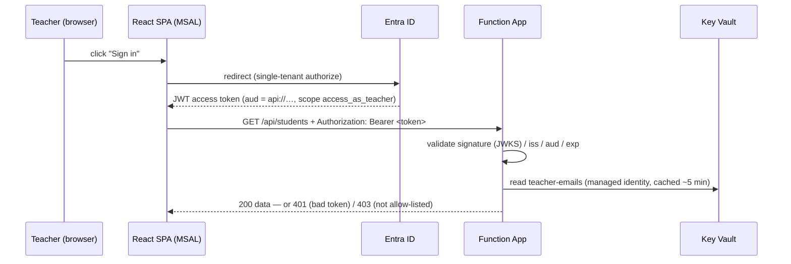

# REQ-004 — Teacher sign-in with Microsoft Entra ID (plan)

Working plan for [REQ-004](../STORIES.md#req-004--teacher-signs-in-with-microsoft-entra-id).
Written 2026-07-16, against the two-environment world (dev / prod).

## Goal

Only the teacher (and a small allow-list of emails) can reach student data. The
gate lives **in the API** — the frontend hiding menu items is UX, not security
(the data is one `curl` away today: every endpoint is `authLevel: 'anonymous'`).
Total added cost ≈ £0.

**Non-goals:** Google-branded login (possible later via External ID federation),
multi-teacher roles/permissions, protecting the public pages (REQ-006/007 stay
open), the REQ-003 route split itself (this plan delivers its mechanism).

## Decisions

| Decision | Choice | Why |
| --- | --- | --- |
| Identity provider | **Entra ID, workforce, single-tenant** | Free at any SWA tier. Google as a direct SWA provider requires Standard (~$9/app/month). Single-tenant means only accounts in our tenant can authenticate at all — the first wall. |
| Where auth is enforced | **In Function code (JWT validation)** | Two platform routes are closed: SWA Free auth doesn't protect a separate cross-origin Function App, and **Flex Consumption doesn't support Easy Auth** (confirmed). So the API validates tokens itself. |
| Allow-list | **Emails, comma-separated, in Key Vault** (`teacher-emails`) | A few humans, readable config, editable without a deploy. Key Vault (not app settings) because it establishes the managed-identity pattern REQ-009 needs anyway. Emails are safe to match here *because* the tenant is single-tenant; revisit `oid`-matching if that ever changes. |
| Secret access | **System-assigned managed identity** + `Key Vault Secrets User` RBAC | No connection string or key anywhere. SDK read (`@azure/identity` + `@azure/keyvault-secrets`), **not** `@Microsoft.KeyVault(...)` app-setting references — Flex Consumption's app-setting behaviour makes references untrustworthy; the SDK path needs no platform support. |
| Rollout | **Two-phase via `AUTH_ENFORCED` app setting** | The API must deploy before the frontend (repo DoD). An API that hard-requires tokens would break the live frontend until it ships — the flag gives a zero-breakage window: validate-and-log first, enforce after the frontend is live. |

## How it works



The SPA never sees a secret; the API never sees a password. Sign-out = MSAL
`logoutRedirect` + local token cache clear.

## Building blocks

### 1. Entra app registrations (Terraform, per env)

One **API** registration + one **SPA** registration per environment (dev, prod),
in the existing tenant `d2fa8fd6-…`. The repo already runs the `azuread`
provider (the OIDC module), so this is more of the same:

- API app: expose scope `access_as_teacher`; identifier URI `api://<client-id>`.
- SPA app: `spa` redirect URIs — the env's SWA URL, plus `http://localhost:3000`
  on **dev only** (keeps local `npm start` sign-in working).
- SPA → API: `required_resource_access` on the exposed scope.
- Single-tenant (`signInAudience = AzureADMyOrg`).

### 2. Key Vault + managed identity (Terraform, per env)

- `azurerm_key_vault` (standard tier, RBAC mode) per env.
- Secret `teacher-emails` = comma-separated allow-list. Seed value via
  `terraform.tfvars` (not committed); edit later in the portal — no deploy.
- Function App gets `identity { type = "SystemAssigned" }`.
- `azurerm_role_assignment`: that identity → `Key Vault Secrets User` on the vault.
- New app settings on the Function App: `TENANT_ID`, `API_CLIENT_ID`,
  `KEY_VAULT_URL`, `AUTH_ENFORCED` (start `false`).

### 3. API: token validation (backend repo)

New `src/shared/auth.ts`, used by every **teacher** endpoint (all of them today):

```ts
// deps: jsonwebtoken, jwks-rsa, @azure/identity, @azure/keyvault-secrets
const jwks = jwksClient({
  jwksUri: `https://login.microsoftonline.com/${TENANT_ID}/discovery/v2.0/keys`,
})

export async function requireTeacher(request: HttpRequest):
    Promise<{ email: string } | HttpResponseInit> {
  const token = (request.headers.get('authorization') ?? '').replace(/^Bearer /, '')
  if (!token) return unauthorized('Missing bearer token.')

  let payload: jwt.JwtPayload
  try {
    payload = await verify(token, {          // signature via JWKS, plus:
      issuer: `https://login.microsoftonline.com/${TENANT_ID}/v2.0`,
      audience: API_CLIENT_ID,               // exp checked by jsonwebtoken
    })
  } catch {
    return unauthorized('Invalid or expired token.')
  }

  const email = (payload.preferred_username ?? payload.email ?? '').toLowerCase().trim()
  const allowed = await getTeacherEmails()   // Key Vault, cached ~5 min
  if (!allowed.includes(email)) return forbidden(`${email} is not an allowed teacher.`)
  return { email }
}
```

- `getTeacherEmails()` caches in module scope with a short TTL: one Key Vault
  read per cold start / 5 minutes, not per request.
- While `AUTH_ENFORCED=false`: run the same checks, **log** the outcome, let the
  request through. Flip to `true` once the frontend ships.
- `shared/http.ts` grows `unauthorized()` (401) and `forbidden()` (403).

### 4. Frontend: MSAL (this repo)

- Deps: `@azure/msal-browser` + `@azure/msal-react`.
- `src/auth/msal.ts`: `PublicClientApplication` from
  `VITE_ENTRA_TENANT_ID` / `VITE_ENTRA_SPA_CLIENT_ID` / `VITE_ENTRA_API_SCOPE`
  (baked per env like `VITE_API_BASE_URL`; empty ⇒ auth-less local/test mode
  so tests and the API-down path keep working).
- `apiRequest()` in `src/api/client.ts` acquires a token
  (`acquireTokenSilent` → redirect fallback) and adds the `Authorization`
  header. One choke point — endpoint modules don't change.
- Shell: sign-in screen when unauthenticated, sign-out in the topbar, and a
  401/403-from-API state that offers re-auth.
- Tests: mock `@azure/msal-react` (100 % coverage gate stands; MSAL itself is
  not ours to test).

### 5. What this does *not* change

CORS stays as-is (same origins call the same APIs). The dev-server `/api` proxy
keeps working — the bearer header rides through it. Seed data, endpoints and
response shapes are untouched.

## Rollout (zero-breakage order)

1. **Terraform** (both repos' infra): registrations, vault, identity, settings.
   `AUTH_ENFORCED=false`.
2. **Backend deploy**: validation live but not enforced. Watch logs — real
   traffic shows `would-reject` entries only for anonymous callers.
3. **Frontend deploy**: sign-in shipped; every request now carries a token.
4. **Flip `AUTH_ENFORCED=true`** (app setting change, no deploy) — dev first,
   soak, then prod.
5. Delete the flag once REQ-003 lands (enforcement becomes unconditional).

Rollback at any step = flip the flag back / redeploy previous frontend.

## Costs

| Item | Cost |
| --- | --- |
| Entra ID workforce sign-in, app registrations | £0 |
| SWA Free tier (unchanged) | £0 |
| Key Vault standard | ~£0.03 per 10k operations — with caching, pennies/year |
| Managed identity | £0 |
| **Total** | **≈ £0** |

## Risks / open questions

- **Token claim for email**: `preferred_username` is the reliable claim on
  workforce tokens; verify it carries the email for your account shape during
  dev (fallback `email` claim already handled).
- **Clock/JWKS outages**: JWKS fetch failures must fail *closed* when enforced —
  but cached keys make this rare.
- **Local dev**: uses the dev registration's `localhost` redirect URI; anyone
  running locally still needs an allow-listed account (correct behaviour).
- ❓ **Sign-in UX**: full-page redirect (simplest, recommended) vs popup.
  Assumed redirect.
- ❓ Should the **dev** env enforce earlier/always once stable? Assumed yes,
  after step 4 soak.

## Task breakdown

Backend-first, per the repo DoD. Roughly a week of evenings; each step ships.

- [ ] **T1 · infra (backend repo)**: Terraform module for per-env app
      registrations (API + SPA), Key Vault + `teacher-emails`, managed identity
      + RBAC, new app settings. `terraform apply` dev, then prod. (M)
- [ ] **T2 · backend**: `shared/auth.ts` (JWKS validation + Key Vault allow-list
      + `AUTH_ENFORCED` flag), wire into all handlers, `unauthorized`/`forbidden`
      helpers. Deploy. (M)
- [ ] **T3 · frontend**: MSAL setup, sign-in/out UI, bearer header in
      `apiRequest`, 401/403 handling, env vars in GitHub Environments, tests to
      100 %. Deploy. (L)
- [ ] **T4 · flip**: `AUTH_ENFORCED=true` dev → verify with `/verify` skill +
      a raw `curl` (expect 401) → prod. Update README/DEPLOYMENT docs. (S)
- [ ] **T5 · follow-up**: STORIES.md tick, REQ-003 unblocked (route split can
      now build on `useIsAuthenticated`). (XS)
