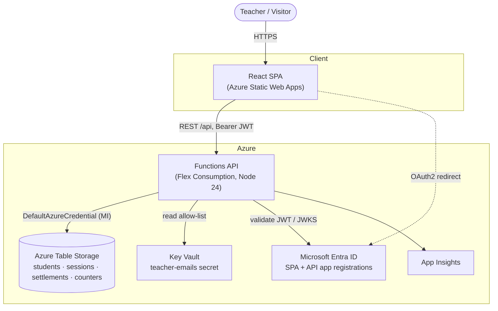
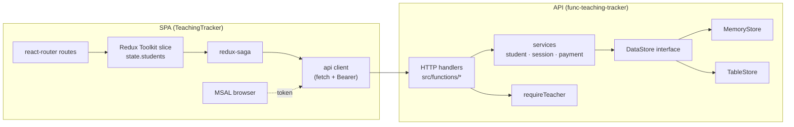
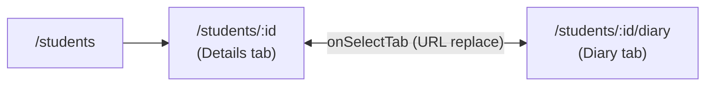
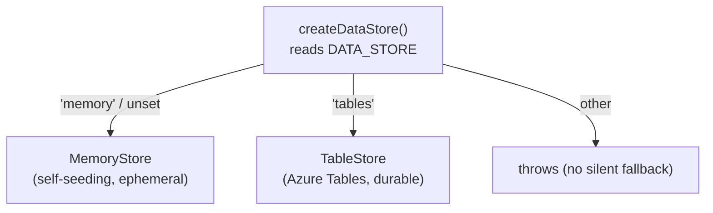
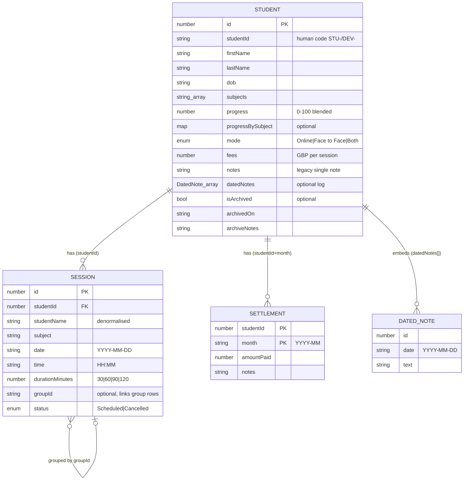
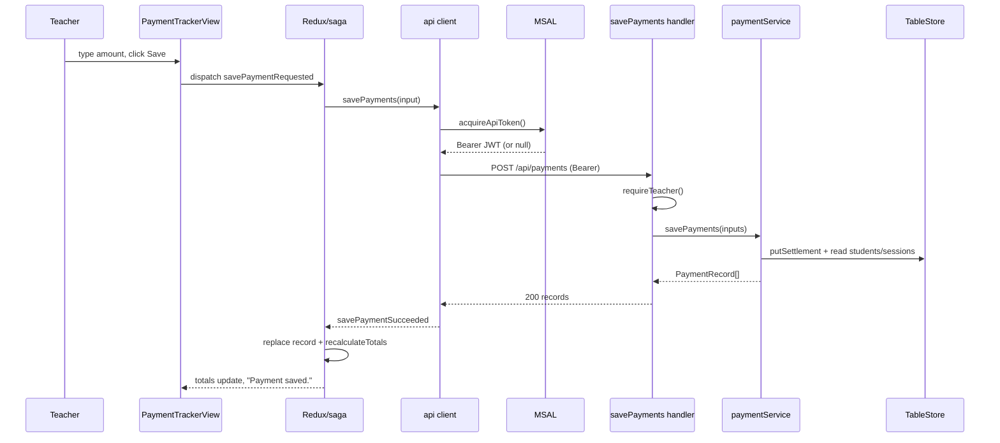
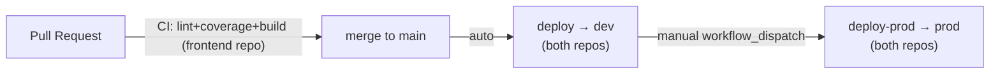

# Teaching Tracker — Technical Design Document (TDD)

> Whole-system technical design across both repositories:
> **`TeachingTracker`** (React SPA) and **`func-teaching-tracker`** (Azure Functions API + Terraform infra).
> Every claim is grounded in source; citations use `file:line`. Companion: [IFDD.md](./IFDD.md) (interface & functional spec).

| | |
|---|---|
| **Product** | A private, single-teacher tutoring tracker: students, classes, monthly payments, per-student dated notes ("Diary"). |
| **Audience** | The engineer/maintainer. Design + build reference, kept honest against the code. |
| **Version** | App `1.0.0` (`src/version.ts`). |
| **Status** | Live. Dev + prod on Azure; both on durable Table Storage. |

---

## 1. System context

A browser SPA talks to a stateless HTTP API, which persists to Azure Table Storage. Microsoft Entra ID provides sign-in; a teacher allow-list in Key Vault authorises.

**Design tenets**
- **API owns truth.** Bills (`amountDue`) and status are *derived* server-side from classes actually held; the client never recomputes what is owed (`store.ts:63-66`, `paymentService.ts:52-75`).
- **Config over code per environment.** The API is one artifact; behaviour (data store, auth enforcement) comes from app settings. The SPA is the exception — Vite inlines env at build time, so it is built once per environment.
- **Keyless everywhere.** CI deploys via GitHub OIDC (no stored secrets); the API reaches storage/secrets via its managed identity + AAD RBAC.
- **Graceful degradation.** Auth is a *flag*: when not enforced, the API logs "would refuse" and lets the request through, so the frontend works before sign-in is switched on (`auth.ts:155-164`).

---

## 2. Container architecture

**Stacks**
- **Frontend:** React 18 + TS + Vite 5, Redux Toolkit + redux-saga, MUI v9, react-router v6, MSAL. Single Redux slice `students`; all async via sagas; all HTTP via a thin `apiRequest` wrapper.
- **Backend:** Azure Functions v4 programming model (`app.http(...)`, `authLevel: 'anonymous'`), Node 24, TypeScript → `dist` (CommonJS). Handlers are thin; logic in services; persistence behind a `DataStore` interface with two adapters.

---

## 3. Frontend design

### 3.1 Bootstrap & providers
`index.html → main.tsx → App.tsx`. Provider tree (`App.tsx:93-110`): `Provider(store)` → `BrowserRouter` → (conditionally) `MsalProvider` → `AppShell` (`ThemeProvider` + `CssBaseline`). The `MsalProvider` is **omitted entirely** in auth-less mode (`getMsalInstance()` returns `null`).

Initial data: `InitialDataBoundary` (`App.tsx:65-66`) chooses between firing all three fetches immediately (auth-less) and `AuthGatedInitialData`, which waits for the MSAL handshake (`InteractionStatus.None`) and an account before dispatching `fetchStudentsRequested / fetchPaymentsRequested / fetchSessionsRequested`; if settled-and-signed-out it dispatches `initialLoadSkipped()` so the busy bar stops.

### 3.2 Routing (`src/ROUTE.tsx`, `src/paths.ts`)
Ten routes; eight teacher-gated via `teacher(page) = <RequireTeacher>{page}</RequireTeacher>` (`ROUTE.tsx:585`); `/offerings` and `/contact` are public. Unknown paths redirect to the dashboard. Each route *wrapper* filters archived students out of active surfaces (`isArchived`), and the dashboard/scheduling wrappers additionally strip sessions belonging to archived students (`ROUTE.tsx:88-97, 520-529`). The student page is one component with two deep-linkable tabs:

### 3.3 State management
One RTK slice, `state.students` (`store.ts:47-60`): the `students`, `scheduledSessions`, `paymentsByMonth` collections; `loading / paymentsLoading / sessionsLoading` and `savingStudent / savingSession / savingPayment` flags; a sticky `error` and a transient `notice` toast; and `hasLocalStudentChanges` (guards a background refetch from clobbering unsaved local edits, `store.ts:137-155`).

**Request → saga → API → success/fail** is the universal shape. Every mutation reducer sets its `saving*` flag; the saga calls the API and dispatches `*Succeeded` (which merges the server's returned record and raises a success `notice`) or `*Failed` (which sets `error` + an error `notice`). See [§5 sagas table](#52-services) and the IFDD flows.

**Derived-total invariant:** `recalculateTotals(group)` recomputes only `totalReceived = Σ amountPaid` and `totalOutstanding = max(totalDue − totalReceived, 0)`; `totalDue` is summed from the API's per-record `amountDue`, never from fees (`store.ts:67-80`).

### 3.4 Auth on the client (`src/auth/msal.ts`)
A deliberately React-free module so the plain-`fetch` client can obtain tokens. `isAuthConfigured()` is true only when all three `VITE_ENTRA_*` vars are set. `acquireApiToken()` does `acquireTokenSilent`, falling back to `acquireTokenRedirect`; it returns `null` in auth-less mode, and `apiRequest` then sends the request **without** an `Authorization` header (`client.ts:50-56`). `RequireTeacher` renders children directly when auth-less, else gates on `AuthenticatedTemplate`/`UnauthenticatedTemplate`.

### 3.5 Build, test, quality
Vite (scss modern compiler; manualChunks split `mui`/`vendor`; dev proxy `/api → dev Function App` when `VITE_API_BASE_URL` unset). **Vitest with v8 coverage at 100% thresholds on branches/functions/lines/statements** (`vitest.config.ts:11-20`) — every component has a co-located test, plus `ComponentCoverage.test.tsx` to hold the line. ESLint flat config + Prettier.

---

## 4. Backend design

### 4.1 Handlers (`src/functions/*`)
Thin adapters registered with `app.http(...)`, `authLevel: 'anonymous'`. Each data endpoint calls `requireTeacher()` first, validates params/body, delegates to a service, and maps the result to a status code. Error bodies are uniformly `{ error: string }` (`http.ts:16-46`). Full contracts in the [IFDD](./IFDD.md#2-api-reference).

### 4.2 Services
- **studentService** — `upsertStudent` merges `{...existing, ...sanitize(input)}` (undefined-stripped so a patch never clobbers), reconciles blended progress from `progressBySubject` (REQ-014), and **refreshes denormalised session names** on any save; `archiveStudent` cancels (never deletes) future non-cancelled classes and stamps `isArchived/archivedOn/archiveNotes`; validation lives in `validateStudentInput`.
- **sessionService** — group classes are **N rows sharing `groupId = grp-<firstId>`**; ids are reserved as a contiguous block; `addSessionMember` promotes a solo class to a group and restores a cancelled member row rather than duplicating; edits/cancels can fan out across the group via `applyToGroup`.
- **paymentService** — **bills are derived, never stored.** For each student × billable month it computes `sessionsHeld` (held = not-Cancelled and date ≤ today), `amountDue = sessionsHeld × fees`, then overlays the stored `PaymentSettlement` (`amountPaid`, `notes`) to produce a `PaymentRecord`. Only settlements persist.

### 4.3 Persistence (`src/data/*`)
A single `DataStore` interface with two adapters selected at process start:

- **MemoryStore** seeds from `buildSeedForEnv(ENVIRONMENT)` at construction; not durable (resets on restart/scale-out). Used for tests and local `func start`.
- **TableStore** — four tables, single partition each; row keys are zero-padded ids (students width 6, sessions width 8); settlements use a **composite key** `${pad(studentId,6)}_${month}`. Table Storage has no array/object columns, so `subjects`, `progressBySubject`, and **`datedNotes`** ride as JSON strings (`*Json` columns, written only when present). Ids are handed out by an **ETag-guarded counter** (`reserveIds`, optimistic `If-Match` with retry). Auth is `DefaultAzureCredential` (managed identity in Azure; `az login` locally); the four tables are **not** created by Terraform — a one-off seeder creates them over AAD.
- **Store factory** (`store.ts`): `environmentName` from `ENVIRONMENT`; `dataStore` from `DATA_STORE` (`memory` | `tables`, else throw). The module-level singleton is created once at import — hence a **config flip requires a process restart** to take effect (see [§10 risks](#10-known-gaps-risks--tech-debt)).

### 4.4 Server-side auth (`src/shared/auth.ts`)
`requireTeacher` extracts a Bearer JWT, verifies it (RS256, issuer `.../v2.0`, audience = API client id, signature via cached tenant JWKS), checks the `access_as_teacher` scope, and checks the caller's email against the Key-Vault allow-list (`teacher-emails`, 5-min cache, **fail-closed** if unavailable). The `AUTH_ENFORCED` app setting decides whether a failing verdict **blocks** (403/401) or is merely **logged** while the request proceeds — the zero-downtime path to switching sign-in on.

---

## 5. Data model

**Derived, not stored:** `PaymentRecord` / `MonthlyPaymentGroup` (bills) are computed per request from students × months × held-sessions × settlements. `sessionsHeld`, `amountDue`, `outstanding`, `status` are all derived. See the [IFDD data dictionary](./IFDD.md#3-data-dictionary).

---

## 6. Key flows

**Payment save (authenticated), the canonical request lifecycle:**

Other flows (add diary note, schedule/edit class, archive/restore) follow the same request→saga→API→succeeded shape; step-by-step versions are in the [IFDD user journeys](./IFDD.md#5-user-journeys).

---

## 7. Security design

- **Sign-in:** Entra single-tenant (`AzureADMyOrg`) SPA + API app registrations; the API app issues v2.0 tokens (so `iss` matches the verifier), exposes one delegated scope `access_as_teacher`, and pre-authorises the SPA (no consent prompt).
- **Authorisation:** JWT scope check **and** an email allow-list (`teacher-emails` in an RBAC-only Key Vault), fail-closed. Two teacher emails are provisioned; the vault value is the editing surface post-bootstrap (Terraform `ignore_changes`).
- **Keyless CI:** per-environment GitHub OIDC federated credential, subject `repo:<owner>/<repo>:environment:<env>` — a dev job cannot assume the prod identity. Each CI identity is **Contributor on its app RG only**.
- **Keyless data:** the Function App's system-assigned managed identity holds `Storage Table Data Contributor` on the dedicated data account and `Key Vault Secrets User` on the vault; no account keys in app code.
- **Data protection:** data storage account has `prevent_destroy = true`, no public blob access.

---

## 8. Infrastructure (Terraform)

Local-state Terraform (operator-run via `az login`) provisions everything per environment with `for_each = var.environments`. Three resource groups per env keep the module graph acyclic:

| RG | Contents |
|---|---|
| `rg-teachtracker-<env>` | Storage (app/deploy), Log Analytics, App Insights, **Flex Consumption (FC1)** plan, Function App (system-assigned MI) |
| `rg-teachtracker-<env>-data` | Dedicated data Storage account (`stdata<env><suffix>`), `prevent_destroy` |
| `rg-teachtracker-<env>-auth` | Entra SPA+API app registrations, RBAC Key Vault (`teacher-emails`) |

The root wires cross-module role assignments (`func_writes_data`, `deployer_writes_data`, `func_reads_secrets`) and passes auth/data outputs into the Function App as app settings (`TENANT_ID`, `API_CLIENT_ID`, `KEY_VAULT_URL`, `AUTH_ENFORCED`, `DATA_STORE`, `DATA_TABLES_URL`). Terraform outputs are the **source of the GitHub Environment variables** the workflows consume.

**Environment matrix (`variables.tf:41-59`):**

| | dev | prod |
|---|---|---|
| region | `uksouth` | `uksouth` |
| max instances | 40 | 100 |
| CORS origin | dev SWA | prod SWA |
| `auth_enforced` | `true` | `false` |
| `data_store` | `tables` | `tables` |

---

## 9. CI/CD & deployment

- **CI** (`TeachingTracker/ci.yml`): lint + `test:coverage` (100% gate) + build on every PR and main push. The backend has no CI workflow — its deploy builds directly.
- **Build-once-deploy (backend):** one artifact (`dist` + pruned prod `node_modules`), OIDC login, `functions-action` deploy. Same bytes to any env; config is app settings.
- **Build-per-env (frontend):** Vite inlines `VITE_API_BASE_URL` + Entra config at build time, so dev and prod are separate builds → separate Static Web Apps.
- **Prod is manual** (`deploy-prod.yml`, `workflow_dispatch`) — the free-plan substitute for a required-reviewer gate.

**Data-store cutover runbook (per env):** provision the data account (Terraform) → seed tables over AAD (`npm run seed` for dev, `--empty` for prod) → flip `data_store` to `tables` in the map and `terraform apply` (updates one app setting) → **restart/redeploy** so the process re-reads config.

---

## 10. Known gaps, risks & tech debt

| Area | Finding | Impact |
|---|---|---|
| **OpenAPI drift** | Spec omits `DELETE /sessions/{id}`, `POST /sessions/{id}/members`; `Student` schema lacks `datedNotes`; `by-month` doc says `totalExpected` vs code `totalDue`. | Consumers/docs mislead. Regenerate/extend the spec. |
| **Config reload** | `dataStore` is a module singleton read at import; an app-setting flip needs a restart/redeploy to take effect (observed during the prod cutover). | Operational gotcha — always restart after flipping `DATA_STORE`. |
| **Prod auth (pending)** | `auth_enforced = false` in prod — the API logs but does not reject unauthenticated calls. | Anyone with the URL can read/write prod data. Fix queued: PR #26 flips it to `true` (sign-in already verified end-to-end); apply pending. |
| **Local TF state** | State is local (gitignored) and holds secrets (storage key, vault values). | Workstation-bound trust boundary; single-operator risk. Consider a remote encrypted backend. |
| **Shared-key on data account** | `shared_access_key_enabled = true` (provider data-plane reads). | Hardening deferral toward GDPR §10.4. |
| **Denormalised names** | Session rows cache student name/year; healed on save via `refreshSessionNames`. | Acceptable; documented self-healing. |

---

## 11. GDPR & data protection (REQ-009)

The durable store holds **personal data about children** — names, DOB, school, parent contact, home address, progress notes. The teacher is the **data controller** under UK GDPR / DPA 2018 (Microsoft the processor); children's data warrants extra care (Recital 38). The plan of record is `func-teaching-tracker/docs/PLAN-req-009-database.md` §10; this section records what is **actually in place** versus what is outstanding, verified against the live prod resources.

> **Status (this hardening pass):** prod is now **UK-resident** (moved US → UK South), on **durable Table Storage**, and launched **empty**. The two critical gaps are addressed — residency is **done**; auth enforcement is **queued in PR #26** (in-place flip, apply pending). Remaining items below are 🟠 hardening for the backlog.

### Steps taken

| Measure | GDPR basis | How it's implemented | Status |
|---|---|---|---|
| **Right to erasure** | Art. 17 | `DELETE /students/{id}` → `deleteStudentCascade` erases the student **and** all their sessions + settlements; Table deletes are real (no tombstone/soft-delete), so nothing lingers. | ✅ Done |
| **Rectification** | Art. 16 | `PUT /students/{id}` (upsert). | ✅ Done |
| **Data minimisation** | Art. 5(1)(c) | Model stores only what tutoring + billing need; free-text `notes` must not accumulate special-category (health/SEN) data — a controller habit, documented. | ✅ By design |
| **Access control** | Art. 5(1)(f), 32 | Single-tenant Entra sign-in **+** Key Vault email allow-list, **fail-closed**; keyless AAD-only app data plane (managed identity); least-privilege RBAC (only the Function App MI + deployer); CI is OIDC, Contributor on the app RG only. | ✅ Done (caveats below) |
| **Encryption** | Art. 32 | At rest: Azure Storage SSE (default). In transit: TLS ≥ 1.2 (verified `minimumTlsVersion = TLS1_2`). | ✅ Done |
| **Storage isolation** | Art. 32 | Dedicated per-env data account, `prevent_destroy`, `allow_blob_public_access = false` (verified). | ✅ Done |
| **Data residency** | Art. 44–46 | Prod data **and** compute moved to **UK South** (verified live) — no international transfer of UK children's data. Done while prod was empty, so zero data migration. | ✅ Done |
| **Clean register** | Recital 38 / plan §11.1 | Prod launched **empty** — no synthetic children mixed into the real roster (done this cutover). Dev keeps its synthetic seed. | ✅ Done |
| **Retention anchor** | Art. 5(1)(e) | `archivedOn` is recorded as the retention-window anchor for a leaver. | ✅ Field present |
| **Breach blast radius** | Art. 33/34 (support) | Per-env accounts, allow-listed sign-in, two named identities — a small, contained surface. | ✅ Done |

### Outstanding / deferred (honest gaps)

| Sev | Gap | Note |
|---|---|---|
| 🟠 | **Prod auth enforcement (pending)** | `auth_enforced = false` today — the API logs but does not reject unauthenticated calls. Fix queued: **PR #26** flips it to `true` (in-place; sign-in already verified end-to-end), apply pending. |
| 🟠 | **Shared key still enabled** | Data account `allowSharedKeyAccess = true` (verified); target is keyless-only. The app already uses AAD, but the key path remains open (provider data-plane reads). |
| 🟠 | **Automated retention** | The 12-month deletion policy (plan §10.3) is manual; no scheduled sweep off the `archivedOn` anchor. |
| 🟠 | **SAR & backups** | A per-student export (`npm run export`, Art. 15) and export-retention are planned; only `npm run seed` exists today. Any export is itself personal data — controller custody, same retention, deleted alongside an erased student (plan §10.7). |

## 12. Appendix

- **REQ tags** referenced in code: REQ-004 (Entra sign-in), REQ-009 (durable DB / GDPR), REQ-013 (archive/alumni), REQ-014 (per-subject progress).
- **Glossary:** *settlement* = the only stored payment fact (`amountPaid`+`notes`); *bill/record* = derived owed figure; *group class* = N session rows sharing a `groupId`; *held* = a non-cancelled class whose date has passed.
- **Companion doc:** [IFDD.md](./IFDD.md) — endpoint contracts, data dictionary, per-screen functional specs, user journeys.
